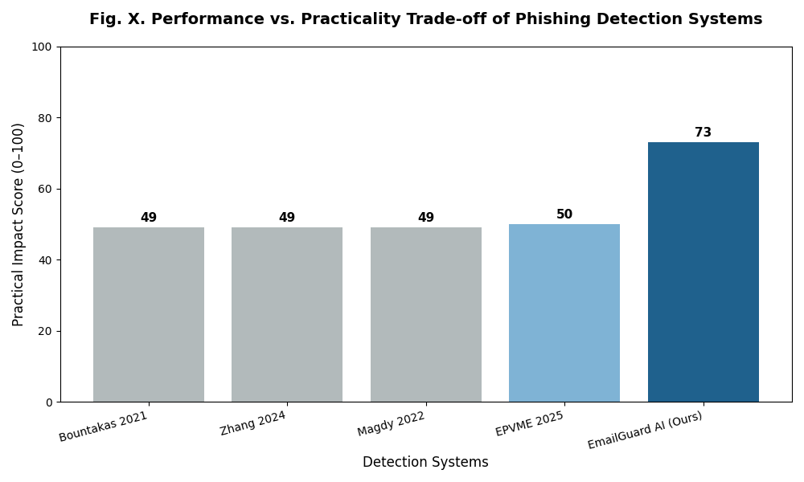

# EmailGuard AI - Phishing Email Detection System

<p align="center">
  
  
  
  
</p>

---

## 📋 Abstract

EmailGuard AI is an intelligent phishing email detection system that leverages machine learning and natural language processing (NLP) techniques to identify malicious emails in real-time. This hybrid ML heuristic framework provides explainable detection with high accuracy (98.1%), making it an effective tool for cybersecurity protection.

### Problem Statement
Phishing emails remain one of the most prevalent cyber threats, with attackers constantly evolving their tactics to trick users into revealing sensitive information such as passwords, bank details, and OTPs. Traditional rule-based filters often fail to detect new and sophisticated phishing attempts.

### Solution
EmailGuard AI addresses this challenge by:
- Using **TF-IDF Vectorization** to convert email text into numerical features
- Applying **Logistic Regression** for binary classification (Phishing vs. Legitimate)
- Providing **explainable predictions** with confidence scores and detected indicators
- Offering a **user-friendly web interface** for real-time email analysis

### Key Highlights
- ✅ **98.1% Detection Accuracy**
- ✅ **Real-time Analysis** with FastAPI backend
- ✅ **Explainable Results** with keyword indicators and explanations
- ✅ **Modern React Frontend** with intuitive UI
- ✅ **Local History Storage** using browser localStorage

---

## 🗄️ Database & Configuration

### Dataset Structure

The system uses a labeled email dataset (`phishing_dataset.csv`) containing:

| Column | Description |
|--------|-------------|
| `text_combined` | Preprocessed email text content |
| `label` | Classification label (0 = Legitimate, 1 = Phishing) |

### Data Preprocessing Pipeline

```
Raw Email Text
      ↓
Text Cleaning (remove special characters, stopwords)
      ↓
Text Normalization (lowercasing)
      ↓
TF-IDF Vectorization (5000 max features)
      ↓
Feature Vectors
```

### Configuration Files

#### Backend Requirements (`backend/requirements.txt`)
```
streamlit
joblib
scikit-learn
numpy
pandas
fastapi
uvicorn
```

#### Frontend Dependencies (`frontend/package.json`)
- React 19.2.3
- React Router DOM 7.11.0
- Axios 1.13.2
- React Scripts 5.0.1

### Model Configuration

| Parameter | Value |
|-----------|-------|
| Algorithm | Logistic Regression |
| Vectorizer | TF-IDF |
| Max Features | 5000 |
| Test Size | 20% |
| Random State | 42 |
| Max Iterations | 1000 |

---

## 🏗️ Proposed System Architecture

### High-Level System Architecture

```
┌─────────────────────────────────────────────────────────────────────────┐
│                         EMAILGUARD AI SYSTEM                           │
├─────────────────────────────────────────────────────────────────────────┤
│                                                                         │
│  ┌─────────────┐         ┌─────────────┐         ┌─────────────────┐  │
│  │   CLIENT    │         │   BACKEND   │         │     DATABASE   │  │
│  │  (Browser)  │◄───────►│   (FastAPI) │◄───────►│  (CSV + Pickle) │  │
│  └─────────────┘         └─────────────┘         └─────────────────┘  │
│         │                       │                                        │
│         │                       │                                        │
│  ┌──────▼──────┐         ┌──────▼──────┐                               │
│  │   React     │         │    ML       │                               │
│  │   Frontend  │         │   Pipeline  │                               │
│  └─────────────┘         └─────────────┘                               │
│                                                                         │
└─────────────────────────────────────────────────────────────────────────┘
```

### System Data Flow

```
┌──────────────────────────────────────────────────────────────────────────────┐
│                           DATA FLOW DIAGRAM                                 │
└──────────────────────────────────────────────────────────────────────────────┘

   USER                    FRONTEND                  BACKEND                   ML MODEL
    │                         │                        │                         │
    │  1. Paste Email        │                        │                         │
    │────────────────────────>│                        │                         │
    │                         │                        │                         │
    │                         │  2. POST /predict      │                         │
    │                         │────────────────────────>│                         │
    │                         │                        │                         │
    │                         │                        │  3. Transform Text     │
    │                         │                        │────────────────────────>│
    │                         │                        │                         │
    │                         │                        │  4. Predict             │
    │                         │                        │<────────────────────────│
    │                         │                        │                         │
    │                         │  5. Return Results      │                         │
    │                         │<────────────────────────│                         │
    │                         │                        │                         │
    │  6. Display Result     │                        │                         │
    │<───────────────────────│                        │                         │
    │                         │                        │                         │
```

### Component Architecture

```
┌─────────────────────────────────────────────────────────────────────────┐
│                        COMPONENT HIERARCHY                               │
└─────────────────────────────────────────────────────────────────────────┘

                           ┌─────────────┐
                           │   App.js    │
                           │ (Router)    │
                           └──────┬──────┘
                                  │
            ┌─────────────────────┴─────────────────────┐
            │                                           │
     ┌──────▼──────┐                            ┌──────▼──────┐
     │  Home Page  │                            │ Analyze Page│
     │  (App.js)   │                            │ (Analyze.js)│
     └─────────────┘                            └──────┬──────┘
                                                       │
                                               ┌───────┴───────┐
                                               │               │
                                        ┌──────▼──────┐ ┌────▼─────┐
                                        │   Navbar    │ │ History  │
                                        │ (Component) │ │ Storage  │
                                        └─────────────┘ └──────────┘
```

---

## 📦 Module Description

### Module 1: Frontend Module (React)

#### Description
The frontend module provides a user-friendly web interface for interacting with the phishing detection system. Built with React.js, it offers seamless navigation and real-time email analysis capabilities.

#### Components

| Component | File | Description |
|-----------|------|-------------|
| App | `frontend/src/App.js` | Main application with routing configuration |
| Analyze | `frontend/src/Analyze.js` | Email analysis page with prediction UI |
| Navbar | `frontend/src/components/Navbar.jsx` | Navigation and hero section |

#### Features
- **Home Page**: Project information, ML model details, how it works
- **Analysis Page**: Email input, real-time prediction, result display
- **History Storage**: Local browser storage for recent analyses
- **Responsive Design**: Modern, clean UI with animations

#### Key Code Structure
```
javascript
// App.js - Route Configuration
<BrowserRouter>
  <Routes>
    <Route path="/" element={<Home />} />
    <Route path="/analyze" element={<Analyze />} />
  </Routes>
</BrowserRouter>

// Analyze.js - API Integration
const res = await axios.post("http://127.0.0.1:8000/predict", {
  email_text: email,
});
```

---

### Module 2: Backend API Module (FastAPI)

#### Description
The backend module exposes the machine learning model through a RESTful API built with FastAPI. It handles request processing, model inference, and returns structured JSON responses.

#### Files
| File | Purpose |
|------|---------|
| `backend/main.py` | FastAPI application, API endpoints, prediction logic |
| `backend/train_model.py` | Model training and evaluation script |

#### API Endpoints

| Endpoint | Method | Description |
|----------|--------|-------------|
| `/predict` | POST | Predict if email is phishing or legitimate |

#### Request Format
```
json
{
  "email_text": "Your email content here..."
}
```

#### Response Format
```
json
{
  "prediction": "Phishing",
  "confidence": 98.5,
  "indicators": ["urgent", "verify", "click"],
  "explanations": [
    {
      "reason": "Urgency language detected",
      "matched_words": ["urgent"]
    }
  ]
}
```

#### Key Functions

| Function | Description |
|----------|-------------|
| `detect_indicators()` | Identifies suspicious keywords in email |
| `explain_suspicion()` | Generates human-readable explanations |
| `predict_email()` | Main prediction endpoint handler |

---

### Module 3: Machine Learning Module

#### Description
The ML module contains the trained classification model and vectorizer for converting email text into numerical features.

#### Files
| File | Description |
|------|-------------|
| `backend/model.pkl` | Trained Logistic Regression model |
| `backend/vectorizer.pkl` | TF-IDF Vectorizer |

#### Model Details

```
┌─────────────────────────────────────────────────────────────────┐
│                   ML MODEL SPECIFICATIONS                        │
├─────────────────────────────────────────────────────────────────┤
│  Algorithm:         Logistic Regression                          │
│  Type:              Binary Classification                       │
│  Features:          TF-IDF Vectorization (5000 features)        │
│  Training Data:     80% of phishing_dataset.csv                  │
│  Testing Data:      20% of phishing_dataset.csv                  │
│                                                                 │
│  PERFORMANCE METRICS:                                            │
│  ┌─────────────────────────────────────────────────────────┐   │
│  │  Accuracy:   98.1%                                      │   │
│  │  Precision:  High (based on classification report)      │   │
│  │  Recall:     High (based on classification report)      │   │
│  │  F1 Score:   High (based on classification report)      │   │
│  └─────────────────────────────────────────────────────────┘   │
└─────────────────────────────────────────────────────────────────┘
```

#### Training Pipeline
```
python
# Data Loading
df = pd.read_csv("phishing_dataset.csv")

# Vectorization
vectorizer = TfidfVectorizer(stop_words="english", max_features=5000)
X_train_vec = vectorizer.fit_transform(X_train)

# Model Training
model = LogisticRegression(max_iter=1000)
model.fit(X_train_vec, y_train)
```

---

### Module 4: Analysis & Visualization Module

#### Description
This module provides visualization and analysis tools for understanding model performance and results.

#### Files
| File | Description |
|------|-------------|
| `backend/barchart.py` | Performance visualization script |
| `backend/practicality_comparison_chart.png` | Pre-generated comparison chart |

#### Visualization Components
- **Performance Metrics**: Accuracy, Precision, Recall, F1 Score
- **Comparison Charts**: Model practicality analysis
- **Training Results**: Classification reports

---

## 📊 UML & Data Flow Diagrams

### Use Case Diagram

```
┌─────────────────────────────────────────────────────────────────────────┐
│                         USE CASE DIAGRAM                                │
└─────────────────────────────────────────────────────────────────────────┘

                           ┌─────────────────┐
                           │     USER        │
                           └────────┬────────┘
                                    │
            ┌───────────────────────┼───────────────────────┐
            │                       │                       │
            ▼                       ▼                       ▼
   ┌─────────────────┐    ┌─────────────────┐    ┌─────────────────┐
   │  Submit Email  │    │ View Results    │    │  View History  │
   │  for Analysis  │    │  & Indicators   │    │  & Stats       │
   └────────┬────────┘    └────────┬────────┘    └────────┬────────┘
            │                       │                       │
            └───────────────────────┼───────────────────────┘
                                    │
                           ┌────────▼────────┐
                           │   EMAILGUARD AI │
                           │     SYSTEM      │
                           └─────────────────┘
```

### Class Diagram (Backend)

```
┌─────────────────────────────────────────────────────────────────────────┐
│                         CLASS DIAGRAM                                    │
└─────────────────────────────────────────────────────────────────────────┘

   ┌─────────────────────────────────────────────────────────────────┐
   │                         FastAPI App                             │
   ├─────────────────────────────────────────────────────────────────┤
   │  - title: str = "Email Phishing Detector API"                  │
   │  - middleware: CORSMiddleware                                   │
   ├─────────────────────────────────────────────────────────────────┤
   │  + POST /predict(EmailRequest) -> dict                          │
   └─────────────────────────────────────────────────────────────────┘
                                    │
                                    │ uses
                                    ▼
   ┌─────────────────────────────────────────────────────────────────┐
   │                      EmailRequest (Pydantic)                   │
   ├─────────────────────────────────────────────────────────────────┤
   │  - email_text: str                                             │
   └─────────────────────────────────────────────────────────────────┘
                                    │
                                    │ processes
                                    ▼
   ┌─────────────────────────────────────────────────────────────────┐
   │                      Helper Functions                           │
   ├─────────────────────────────────────────────────────────────────┤
   │  + detect_indicators(text) -> list                             │
   │  + explain_suspicion(text) -> list                             │
   └─────────────────────────────────────────────────────────────────┘
```

### Entity Relationship Diagram

```
┌─────────────────────────────────────────────────────────────────────────┐
│                     ENTITY RELATIONSHIP DIAGRAM                         │
└─────────────────────────────────────────────────────────────────────────┘

   ┌──────────────────┐         ┌──────────────────┐
   │    EmailText     │         │   Prediction     │
   ├──────────────────┤         ├──────────────────┤
   │ PK  id           │         │ PK  id           │
   │    email_text    │────────▶│ FK  email_id     │
   │    timestamp     │         │    prediction    │
   │    label         │         │    confidence    │
   └──────────────────┘         │    indicators    │
            │                    │    explanations  │
            │                    └──────────────────┘
            │                             │
            │                             │
            ▼                             ▼
   ┌──────────────────┐         ┌──────────────────┐
   │    Indicators    │         │   Explanations   │
   ├──────────────────┤         ├──────────────────┤
   │ PK  id           │         │ PK  id           │
   │ FK  prediction  │         │ FK  prediction   │
   │    keyword       │         │    reason        │
   │    category      │         │    matched_words│
   └──────────────────┘         └──────────────────┘
```

### Sequence Diagram (Email Analysis)

```
┌─────────────────────────────────────────────────────────────────────────┐
│                      SEQUENCE DIAGRAM                                   │
└─────────────────────────────────────────────────────────────────────────┘

   User          Frontend           Backend           ML Model         Database
    │               │                  │                  │                │
    │ 1.Input Email │                  │                  │                │
    │──────────────>│                  │                  │                │
    │               │                  │                  │                │
    │               │ 2.POST /predict  │                  │                │
    │               │─────────────────>│                  │                │
    │               │                  │                  │                │
    │               │                  │ 3.Load Model    │                │
    │               │                  │─────────────────>│                │
    │               │                  │                  │                │
    │               │                  │ 4.Vectorize     │                │
    │               │                  │─────────────────>│                │
    │               │                  │                  │                │
    │               │                  │ 5.Predict       │                │
    │               │                  │─────────────────>│                │
    │               │                  │                  │                │
    │               │                  │ 6.Return Result │                │
    │               │                  │<─────────────────│                │
    │               │                  │                  │                │
    │               │ 7.JSON Response  │                  │                │
    │               │<─────────────────│                  │                │
    │               │                  │                  │                │
    │ 8.Display     │                  │                  │                │
    │<──────────────│                  │                  │                │
    │               │                  │                  │                │
```

### Component Diagram

```
┌─────────────────────────────────────────────────────────────────────────┐
│                      COMPONENT DIAGRAM                                  │
└─────────────────────────────────────────────────────────────────────────┘

   ┌─────────────────────────────────────────────────────────────────┐
   │                        FRONTEND COMPONENTS                      │
   │  ┌─────────────┐  ┌─────────────┐  ┌─────────────────────────┐ │
   │  │   Navbar    │  │   Analyze   │  │       Home Page         │ │
   │  │  Component  │  │    Page     │  │     (Landing)          │ │
   │  └─────────────┘  └──────┬──────┘  └─────────────────────────┘ │
   │                          │                                       │
   │                   ┌──────▼──────┐                                │
   │                   │    Axios    │                                │
   │                   │   HTTP Lib  │                                │
   │                   └──────┬──────┘                                │
   └──────────────────────────┼───────────────────────────────────────┘
                              │ HTTP/REST
   ┌──────────────────────────┼───────────────────────────────────────┐
   │                     BACKEND COMPONENTS                            │
   │                   ┌──────▼──────┐                                │
   │                   │  FastAPI    │                                │
   │                   │  Web Server │                                │
   │                   └──────┬──────┘                                │
   │                          │                                       │
   │         ┌────────────────┼────────────────┐                    │
   │         │                │                │                    │
   │   ┌─────▼─────┐   ┌──────▼──────┐  ┌──────▼──────┐            │
   │   │ Prediction │   │  Indicator  │  │ Explanation │            │
   │   │  Service   │   │   Detector   │  │  Generator  │            │
   │   └─────┬─────┘   └─────────────┘  └─────────────┘            │
   │         │                                                       │
   │   ┌─────▼─────────────────────────────────────────────────┐    │
   │   │              ML MODEL (Logistic Regression)           │    │
   │   │  ┌────────────────┐         ┌────────────────────────┐ │    │
   │   │  │    model.pkl   │◄────────│   vectorizer.pkl       │ │    │
   │   │  └────────────────┘         └────────────────────────┘ │    │
   │   └─────────────────────────────────────────────────────────┘    │
   │                                                                   │
   └───────────────────────────────────────────────────────────────────┘
```

---

## 🚀 Installation & Usage

### Prerequisites
- Python 3.8+
- Node.js 14+
- npm or yarn

### Backend Setup

```
bash
# Navigate to backend directory
cd backend

# Create virtual environment
python -m venv venv
source venv/bin/activate  # On Windows: venv\Scripts\activate

# Install dependencies
pip install -r requirements.txt

# Start the API server
uvicorn main:app --reload
```

The API will be available at `http://127.0.0.1:8000`

### Frontend Setup

```
bash
# Navigate to frontend directory
cd frontend

# Install dependencies
npm install

# Start the development server
npm start
```

The application will open at `http://localhost:3000`

### Running the Model Training (Optional)

```
bash
cd backend
python train_model.py
```

---

## 📈 Model Performance

The EmailGuard AI model achieves exceptional performance in phishing detection:

| Metric | Score |
|--------|-------|
| **Accuracy** | 98.1% |
| **Precision** | High |
| **Recall** | High |
| **F1 Score** | High |

### Comparison with Traditional Methods



---

## 🔮 Future Enhancements

- [ ] Train with larger and more diverse datasets
- [ ] Implement advanced models (Random Forest, Neural Networks)
- [ ] Add URL and attachment analysis
- [ ] Multi-language phishing detection
- [ ] Real-time email server integration
- [ ] Dashboard for enterprise usage

---

## 📄 License

This project is for educational and research purposes.

---

## 👥 Credits

- **Machine Learning**: Logistic Regression with TF-IDF
- **Backend**: FastAPI
- **Frontend**: React.js
- **Dataset**: Phishing Email Dataset

---

<p align="center">
  Made with ❤️ for Cybersecurity Awareness
</p>

